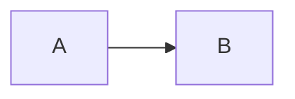

<!-- Generated by scripts/build-skill.mjs from layouts/_shortcodes/ and .vscode/hextra.code-snippets — do not edit by hand.
     Regenerate with: npm run build:skill -->

# Shortcode reference

Every shortcode the theme ships: 58 of them, with parameters taken from the templates in `layouts/_shortcodes/` and examples from the theme's editor snippets.

## Rules that apply throughout

- **Notation is not interchangeable.** A shortcode listed as `{}` renders its body as Markdown and breaks when written with angle brackets. The `{}` shortcodes are: `details`, `include`, `ltr`, `rtl`, `steps`.
- **A paired shortcode needs a closing tag.** Self-closing ones must not have one.
- **Icon names are a closed set.** Any `icon`, `tagIcon`, or `badgeIcon` value must appear in `icons.md`. An unknown name renders nothing and raises no error.
- **Build-time fetching can be switched off.** The shortcodes marked _fetches at build time_ all go quiet when `params.remoteFetch.enable` is `false`.

## Callouts and text

Inline emphasis and short-form content.

### callout

 · paired

A shortcode to create a callout.

| Parameter | Type | Notes |
| --- | --- | --- |
| `content` | string | The content of the callout. _Documented but not read by the template._ |
| `emoji` | string | The emoji of the callout. |
| `icon` | string | The icon of the callout (related to type or can be a custom icon). |
| `type` | string | The type of the callout (default, info, warning, error, important). One of `default`, `info`, `warning`, `error`, `important`. Default `default`. |

```markdown

  Content



  Content



  Content

```

### lead

 · paired

A shortcode to emphasise the opening of an article.

```markdown
An opening sentence set larger than body text.
```

### keywords

 · paired

Group several `keyword` shortcodes into a responsive, wrapping row.

```markdown

  Hugo
  Static sites

```

### keyword

 · paired · accepts positional arguments

Visually highlight an important word or phrase, such as a skill or a technology.

| Parameter | Type | Notes |
| --- | --- | --- |
| `icon` | string | Optional icon to display before the text. Also accepted as the first positional argument. |

Positional: Optional icon to display before the text.

```markdown
Keyword
```

### badge

 · self-closing · accepts positional arguments

A shortcode to create a badge.

| Parameter | Type | Notes |
| --- | --- | --- |
| `border` | string | _Undocumented in the template._ |
| `class` | string | The class of the badge. |
| `color` | string | The color of the badge. One of `gray`, `purple`, `indigo`, `blue`, `green`, `yellow`, `orange`, `amber`, `red`. Deprecated alias: `type`. |
| `content` | string | The content of the badge. |
| `icon` | string | The icon of the badge. |
| `link` | string | The link of the badge. |
| `type` | string | _Undocumented in the template._ |

Positional: The content of the badge.

```markdown





```

### stats

 · paired

A shortcode for presenting concise metrics in a responsive grid.

| Parameter | Type | Notes |
| --- | --- | --- |
| `cols` | string | The number of columns ( One of `1`, `2`, `3`, `4`, `5`, `6`. Default `3)`. Deprecated alias: `columns`. |
| `columns` | string | _Undocumented in the template._ |

```markdown

  Supporting sentence.
  Supporting sentence.

```

### stat

 · paired

A single metric within the `stats` shortcode.

| Parameter | Type | Notes |
| --- | --- | --- |
| `icon` | string | Optional icon displayed above the figure. |
| `label` | string | The short description of the figure. |
| `value` | string | **Required.** The headline figure. |

```markdown
Supporting sentence.
```

### swatches

 · self-closing

A shortcode for showcasing a set of colours, such as a palette.

Positional: Hex colour codes, e.g. "#64748b".

```markdown

```

### icon

 · self-closing · accepts positional arguments

Create an icon.

| Parameter | Type | Notes |
| --- | --- | --- |
| `attributes` | string | The attributes of the icon. Default `height=1em`. |
| `name` | string | The name of the icon. One of `lucide`, `tabler`, `simple`. Also accepted as the first positional argument. |

Positional: The name of the icon.

```markdown



```

### term

 · self-closing · accepts positional arguments

Highlight a glossary term

| Parameter | Type | Notes |
| --- | --- | --- |
| `entry` | string | Either the glossary abbreviation or the term. Also accepted as the first positional argument. |

Positional: Either the glossary abbreviation or the term.

```markdown

```

## Layout and structure

Containers. A child shortcode only works inside its parent.

### cards

 · paired

A shortcode for creating cards.

| Parameter | Type | Notes |
| --- | --- | --- |
| `cols` | string | The number of columns. One of `2`, `3`, `4`. Default `3`. |

```markdown

  
  

```

### card

 · self-closing

A shortcode to create a card.

| Parameter | Type | Notes |
| --- | --- | --- |
| `alt` | string | The alt text for the image ( Default `title if not provided)`. |
| `icon` | string | The icon of the card. |
| `image` | string | The image of the card. |
| `imageStyle` | string | The style of the image. |
| `link` | string | The link to the card. |
| `method` | string | The method to process the image. One of `Resize`, `Fit`, `Fill`, `Crop`. Default `Resize`. |
| `options` | string | The options to process the image. Default `800x webp q80`. |
| `process` | string | Default `(printf "%s %s" $method $options)`. _Undocumented in the template._ |
| `subtitle` | string | The subtitle of the card. |
| `tag` | string | The tag of the card. |
| `tagBorder` | string | _Undocumented in the template._ |
| `tagColor` | string | The color of the tag. One of `gray`, `purple`, `indigo`, `blue`, `green`, `yellow`, `orange`, `amber`, `red`. Deprecated alias: `tagType`. |
| `tagIcon` | string | _Undocumented in the template._ |
| `tagType` | string | _Undocumented in the template._ |
| `title` | string | The title of the card. |

```markdown





```

### tabs

 · paired

Create a tabbed interface with the given items.

| Parameter | Type | Notes |
| --- | --- | --- |
| `defaultIndex` | string | _Undocumented in the template._ |
| `items` | string | _Undocumented in the template._ |

```markdown

  Content
  Content

```

Site config: `params.page.tabs.sync`.

### tab

 · paired

Create a tab.

| Parameter | Type | Notes |
| --- | --- | --- |
| `icon` | string | The icon of the tab. |
| `name` | string | The name of the tab. Default `(printf "Tab %d" .Ordinal)`. |
| `selected` | string | Whether the tab is selected. |

```markdown
Content
```

### steps

{} · paired

A shortcode for creating a step list.

```markdown
{}

### Step 1

Description

### Step 2

Description

{}
```

### details

{} · paired

A built-in component to display a collapsible content.

| Parameter | Type | Notes |
| --- | --- | --- |
| `closed` | string | Whether the details are closed or not (default: false). |
| `title` | string | The title of the details. |

```markdown
{}

Content

{}
```

### accordion

 · paired

A group of collapsible sections.

| Parameter | Type | Notes |
| --- | --- | --- |
| `mode` | string | "multiple" (default) or "collapse" for one section at a time. One of `multiple`, `collapse`. Default `multiple`. |

```markdown

  
  Content
  
  
  Content
  

```

### accordion-item

 · paired · accepts positional arguments

A single collapsible section within the `accordion` shortcode.

| Parameter | Type | Notes |
| --- | --- | --- |
| `icon` | string | Optional icon shown before the heading. |
| `open` | bool | Whether the section starts open. Default `false`. |
| `title` | string | **Required.** The section heading. Also accepted as the first positional argument. |

Reads from its parent: `mode`.

```markdown

Content

```

### timeline

 · paired

A shortcode for creating a vertical timeline.

```markdown

  
  Content
  

```

### timeline-item

 · paired

A single entry within the `timeline` shortcode.

| Parameter | Type | Notes |
| --- | --- | --- |
| `badge` | string | Optional short text shown as a badge next to the title. |
| `badgeColor` | string | Optional badge colour, see the badge shortcode. One of `gray`, `purple`, `indigo`, `blue`, `green`, `yellow`, `orange`, `amber`, `red`. Default `gray`. |
| `header` | string | The title of the entry. |
| `icon` | string | Optional icon shown on the timeline rail. |
| `subheader` | string | Optional secondary line below the title. |

```markdown

Content

```

### filetree/container

 · paired

A file tree container.

```markdown

  
    
  

```

### filetree/folder

 · paired

A folder in a file tree.

| Parameter | Type | Notes |
| --- | --- | --- |
| `name` | string | The name of the folder. |
| `state` | string | The state of the folder. One of `open`, `closed`. Default `open`. |

```markdown



```

### filetree/file

 · self-closing

A file in a file tree.

| Parameter | Type | Notes |
| --- | --- | --- |
| `name` | string | The name of the file. |

```markdown

```

### borderless-table

 · paired

A table without rules, for reference material.

```markdown

| Name | Type | Default |
| ---- | ---- | ------- |
| `name` | `type` | - |
| `name` | `type` | - |

```

## Links and actions

Navigation away from the page.

### button

 · paired

A shortcode for rendering a button that highlights a primary action.

| Parameter | Type | Notes |
| --- | --- | --- |
| `href` | string | Any URL or path. |
| `icon` | string | Optional icon name shown before the label. |
| `pageRef` | string | Path to an internal page, e.g. "/docs/guide/configuration". |
| `rel` | string | The anchor rel attribute. |
| `style` | string |  One of `primary`, `outline`, `ghost`. |
| `target` | string | The anchor target attribute, e.g. "_blank". |

```markdown
Label

Get started
```

### cta

 · self-closing

A call to action: the same button, written as a single self-closing tag.

| Parameter | Type | Notes |
| --- | --- | --- |
| `icon` | string | Optional icon name shown before the label. |
| `label` | string | Button text. Default `the "learnMore" translation`. |
| `rel` | string | The anchor rel attribute. |
| `style` | string |  One of `primary`, `outline`, `ghost`. |
| `target` | string | The anchor target attribute, e.g. "_blank". |
| `url` | string | Destination URL or path. Default `"#"`. |

```markdown

```

### email

 · self-closing · accepts positional arguments

An obfuscated mailto link.

| Parameter | Type | Notes |
| --- | --- | --- |
| `bcc` | string | Optional blind carbon copy address. |
| `body` | string | Optional message body. |
| `cc` | string | Optional carbon copy address. |
| `email` | string | **Required.** The address, with or without a "mailto:" prefix. Also accepted as the first positional argument. |
| `subject` | string | Optional subject line. |
| `text` | string | Link text. Default `the address itself, also obfuscated`. |

```markdown

```

### article

 · self-closing · accepts positional arguments

Embed a link to another page as a card, with its cover, meta and summary.

| Parameter | Type | Notes |
| --- | --- | --- |
| `compactSummary` | bool | Clamp the summary to a single line. Default `false`. |
| `cover` | bool | Show the page's cover image when it has one. Default `true`. |
| `link` | string | **Required.** Path or permalink of the page, e.g. "/blog/my-post". Also accepted as the first positional argument. |
| `showSummary` | bool | Show the page summary. Default `true`. |

```markdown

```

### list

 · self-closing

List recent pages from the site, optionally filtered by a page parameter.

| Parameter | Type | Notes |
| --- | --- | --- |
| `cardView` | bool | Show covers in a grid instead of a compact list. Default `false`. |
| `limit` | int | **Required.** How many pages to show. |
| `title` | string | Optional heading above the list. |
| `value` | string | Value that `where` must match. |
| `where` | string | Page field to filter on, e.g. "Type" or "Params.tags". |

```markdown

```

## Media

Images, video, and rich embeds.

### gallery

 · paired

A shortcode for creating an image gallery.

| Parameter | Type | Notes |
| --- | --- | --- |
| `cols` | number | Number of columns (default 3, ignored for masonry which is responsive) Default `3`. |
| `gap` | string | Gap between items (CSS length, 5rem") Default `"0`. |
| `type` | string | Layout type: grid (default) \| mosaic \| masonry \| carousel One of `grid`, `mosaic`, `masonry`, `carousel`. Default `grid`. |

```markdown

  
  

```

### gallery-item

 · self-closing · accepts positional arguments

A single item inside a gallery container.

| Parameter | Type | Notes |
| --- | --- | --- |
| `alt` | string | Alt text ( Default `caption, then empty)`. |
| `caption` | string | Caption shown under the image and in the lightbox. |
| `height` | number | Explicit height (required for remote URLs that can't be auto-detected). |
| `link` | string | Optional link. When set, clicking opens this URL instead of the lightbox. |
| `span` | string | Mosaic span hint - "wide" (2 cols), "tall" (2 rows), or "large" (2x2). One of `wide`, `tall`, `large`. |
| `src` | string | **Required.** Image source. Page resource, global asset, static path, or remote URL. Also accepted as the first positional argument. |
| `thumb` | string | Optional smaller image used in-page ( Default `a derived resize for local images)`. |
| `width` | number | Explicit width (required for remote URLs that can't be auto-detected). |

```markdown



```

### video

 · self-closing · accepts positional arguments

Embed a video with an optional poster and caption.

| Parameter | Type | Notes |
| --- | --- | --- |
| `autoplay` | bool | Play on load. Implies muted. Default `false`. |
| `caption` | string | Markdown caption shown below the video. |
| `controls` | bool | Show playback controls. Default `true`. |
| `end` | int | End time in seconds. |
| `fit` | string |  One of `contain`, `cover`, `fill`. Default `contain`. |
| `loop` | bool | Loop playback. Default `false`. |
| `muted` | bool | Start muted. Default `false`. |
| `playsinline` | bool | Play inline on mobile rather than fullscreen. Default `true`. |
| `poster` | string | Poster image URL or local path. |
| `preload` | string |  One of `metadata`, `none`, `auto`. Default `metadata`. |
| `ratio` | string | Aspect ratio as W/H. Default `16/9`. |
| `src` | string | **Required.** Video URL or local path. Also accepted as the first positional argument. |
| `start` | int | Start time in seconds. |

```markdown



```

### youtube-lite

 · self-closing · accepts positional arguments · fetches at build time

Embed a YouTube video as a facade: a poster image and a play button that swap themselves for the real player on click.

| Parameter | Type | Notes |
| --- | --- | --- |
| `id` | string | **Required.** The YouTube video id. Also accepted as the first positional argument. |
| `label` | string | Accessible name for the play button, e.g. the video title. |
| `params` | string | Extra player parameters, e.g. "start=130&controls=0". |

```markdown

```

### pdf

 · self-closing · accepts positional arguments

Shortcode to include a PDF file in a page.

Positional: The path to the PDF file.

```markdown

```

### chart

 · paired

Draw a chart with Chart.js from a configuration written inside the shortcode.

| Parameter | Type | Notes |
| --- | --- | --- |
| `title` | string | Accessible description of what the chart shows. |

```markdown

type: 'bar',
data: { labels: ['Tomato', 'Apple'], datasets: [{ label: '# of votes', data: [12, 19] }] }

```

### typeit

 · paired

Type out one or more strings with a typewriter effect.

| Parameter | Type | Notes |
| --- | --- | --- |
| `breakLines` | bool | Type strings on separate lines instead of replacing. Default `true`. |
| `classList` | string | Extra CSS classes for the element. |
| `initialString` | string | String shown before typing starts, then deleted. |
| `lifeLike` | bool | Vary the pace as a person would. Default `true`. |
| `loop` | bool | Restart after the last string. Default `false`. |
| `speed` | int | Milliseconds between characters. Default `100`. |
| `startDelay` | int | Milliseconds before typing begins. Default `250`. |
| `tag` | string | HTML tag to render the strings in. One of `div`, `h1`, `h2`, `h3`, `h4`, `p`, `span`. Default `"div"`. |
| `waitUntilVisible` | bool | Wait until scrolled into view. Default `true`. |

```markdown

First line
Second line

```

### asciinema

 · self-closing · accepts positional arguments

Get parameters

| Parameter | Type | Notes |
| --- | --- | --- |
| `autoplay` | string | Default `false`. _Undocumented in the template._ |
| `file` | string | Also accepted as the first positional argument. _Undocumented in the template._ |
| `loop` | string | Default `false`. _Undocumented in the template._ |
| `markers` | string | _Undocumented in the template._ |
| `poster` | string | _Undocumented in the template._ |
| `speed` | string | Default `1`. _Undocumented in the template._ |
| `theme` | string | Default `asciinema`. _Undocumented in the template._ |

```markdown

```

### jupyter

 · self-closing · accepts positional arguments · fetches at build time

Render Jupyter Notebook

| Parameter | Type | Notes |
| --- | --- | --- |
| `prompts` | bool | Show In/Out execution count prompts. Use named params:  |
| `src` | string | _Undocumented in the template._ |

Positional: The path of the Jupyter Notebook.

```markdown

```

Site config: `params.highlight.copy.enable`.

## Code and content import

Pull code or Markdown in from elsewhere.

### gist

 · self-closing · accepts positional arguments · fetches at build time

Embed a GitHub gist.

| Parameter | Type | Notes |
| --- | --- | --- |
| `file` | string | Render only this file from the gist. |
| `hl_lines` | string | Lines to highlight, e.g. "34-38 43". A gist carries no |
| `id` | string | **Required.** The gist id. |
| `lineNoStart` | int | First line number. Default `1`. |
| `lineNos` | bool | Show line numbers. |
| `live` | bool | Re-fetch each file in the reader's browser and refresh it if |
| `user` | string | The gist owner. Accepted for compatibility; the API does not need it. _Documented but not read by the template._ |

Positional: The gist owner. The gist id. Optional filename.

```markdown



```

Site config: `params.highlight.copy.enable`.

### codeimporter

 · self-closing · fetches at build time

Import a code file from an external source and render it as a code block.

| Parameter | Type | Notes |
| --- | --- | --- |
| `endLine` | int | Last line to include, inclusive. |
| `filename` | string | Optional filename header. Pass "auto" to use the URL's last segment. |
| `hl_lines` | string | Lines to highlight, e.g. "34-38 43". Numbers the imported excerpt. |
| `lang` | string | _Undocumented in the template._ |
| `lineNoStart` | int | First line number. Default `1`. |
| `lineNos` | bool | Show line numbers. Default `false`. |
| `live` | bool | Re-fetch in the reader's browser and refresh if changed. Default `false`. |
| `startLine` | int | First line to include, 1-based and inclusive. |
| `type` | string | Language for syntax highlighting. Default `the file extension`. Deprecated alias: `lang`. |
| `url` | string | **Required.** URL of the file. Must be http or https. |

```markdown





```

Site config: `params.highlight.copy.enable`.

### include

{} · self-closing · accepts positional arguments · fetches at build time

Include content from another page in this site, or from a remote Markdown file.

| Parameter | Type | Notes |
| --- | --- | --- |
| `(positional` | string | parameter 0) The path to the page, relative to the content directory. _Documented but not read by the template._ |
| `url` | string | URL of a remote Markdown file. Must be http or https, and |

```markdown
{}
```

Site config: `params.include.allowedHosts`.

## Repository cards

Each fetches at build time. All of them go quiet when `params.remoteFetch.enable` is false.

### github

 · self-closing · accepts positional arguments · fetches at build time

Render a card for a GitHub repository, with its description and current star and fork counts.

| Parameter | Type | Notes |
| --- | --- | --- |
| `repo` | string | **Required.** Repository as "owner/name". Also accepted as the first positional argument. |
| `showThumbnail` | bool | Show the repository's social preview image. Default `false`. |

```markdown

```

### gitlab

 · self-closing · accepts positional arguments · fetches at build time

Render a card for a GitLab project, with its description and current star and fork counts.

| Parameter | Type | Notes |
| --- | --- | --- |
| `baseURL` | string | Instance URL. com". Default `"https://gitlab`. |
| `project` | string | Namespace path, e.g. "gitlab-org/gitlab". Also accepted as the first positional argument. |
| `projectID` | string | **Required.** Numeric project id, e.g. "278964". |
| `showThumbnail` | bool | Show the project's avatar. Default `false`. |

```markdown



```

### gitea

 · self-closing

Render a card for a Gitea repository, with its description, language and current star and fork counts.

| Parameter | Type | Notes |
| --- | --- | --- |
| `icon` | string | Icon shown before the title. Default `"gitea"`. |
| `repo` | string | **Required.** Repository as "owner/name". |
| `server` | string | **Required.** Instance URL, e.g. "https://git.example.com". |
| `showThumbnail` | bool | Show the owner's avatar. Default `false`. |

```markdown

```

### forgejo

 · self-closing

Render a card for a Forgejo repository, with its description, language and current star and fork counts.

| Parameter | Type | Notes |
| --- | --- | --- |
| `icon` | string | Icon shown before the title. Default `"forgejo"`. |
| `repo` | string | **Required.** Repository as "owner/name". |
| `server` | string | **Required.** Instance URL, e.g. "https://v11.next.forgejo.org". |
| `showThumbnail` | bool | Show the owner's avatar. Default `false`. |

```markdown

```

### codeberg

 · self-closing · accepts positional arguments

Render a card for a Codeberg repository, with its description, language and current star and fork counts.

| Parameter | Type | Notes |
| --- | --- | --- |
| `icon` | string | Icon shown before the title. Default `"codeberg"`. |
| `repo` | string | **Required.** Repository as "owner/name". Also accepted as the first positional argument. |
| `server` | string | Instance URL. org". Default `"https://codeberg`. |
| `showThumbnail` | bool | Show the owner's avatar. Default `false`. |

```markdown

```

### huggingface

 · self-closing · fetches at build time

Render a card for a Hugging Face model or dataset, with its task, likes and download count.

| Parameter | Type | Notes |
| --- | --- | --- |
| `dataset` | string | Dataset as "owner/name", e.g. "stanfordnlp/imdb". |
| `model` | string | **Required.** Model as "owner/name", e.g. "google-bert/bert-base-uncased". |
| `showThumbnail` | bool | Show the owner's avatar. Default `false`. |

```markdown



```

### ansible

 · self-closing · fetches at build time

Render a card for an Ansible Galaxy role or collection, with its description and download count.

| Parameter | Type | Notes |
| --- | --- | --- |
| `collection` | string | Collection as "namespace.name", e.g. "community.general". |
| `icon` | string | Icon shown before the title. Default `"ansible"`. |
| `role` | string | **Required.** Role as "namespace.name", e.g. "geerlingguy.docker". |

```markdown



```

## Home page

Only for a page with `layout: hextra-home`.

### hextra/hero-badge

 · paired

A shortcode for rendering a badge with a link.

| Parameter | Type | Notes |
| --- | --- | --- |
| `class` | string | The class of the badge. |
| `link` | string | The link of the badge. |
| `style` | string | The style of the badge. |

```markdown

  <div class="hx:w-2 hx:h-2 hx:rounded-full hx:bg-primary-400"></div>
  <span>New release</span>


<div class="hx:mt-6 hx:mb-6">

  Build modern docs

</div>

<div class="hx:mb-12">

  Fast, batteries-included, and beautiful

</div>

<div class="hx:mb-6">

</div>


  Badge text

```

### hextra/hero-container

 · paired

A simple hero container with an image on the left side.

| Parameter | Type | Notes |
| --- | --- | --- |
| `class` | string | The class of the container. |
| `cols` | string | The number of columns (default: 2). Default `2`. |
| `image` | string | The image of the container. |
| `imageCard` | bool | Whether to display the image as a card (default: false). Default `false`. |
| `imageClass` | string | The class of the image. |
| `imageHeight` | int | The height of the image (default: 350). Default `350`. |
| `imageLink` | string | The link of the image. |
| `imageStyle` | string | The style of the image. |
| `imageTitle` | string | The title of the image. |
| `imageWidth` | int | The width of the image (default: 350). Default `350`. |
| `style` | string | The style of the container. |

```markdown

  Content

```

### hextra/hero-headline

 · paired

A shortcode for displaying a hero headline.

| Parameter | Type | Notes |
| --- | --- | --- |
| `style` | string | The style of the headline. |

```markdown

  Headline

```

### hextra/hero-subtitle

 · paired

A shortcode for displaying a hero subtitle.

| Parameter | Type | Notes |
| --- | --- | --- |
| `style` | string | The style of the subtitle. |

```markdown

  Subtitle

```

### hextra/hero-button

 · self-closing

A shortcode for rendering a button with a link.

| Parameter | Type | Notes |
| --- | --- | --- |
| `link` | string | The link of the button. |
| `style` | string | The style of the button. |
| `text` | string | The text of the button. |

```markdown

```

### hextra/hero-section

 · paired

A simple hero section with a heading and optional style.

| Parameter | Type | Notes |
| --- | --- | --- |
| `content` | string | The content of the heading. _Documented but not read by the template._ |
| `heading` | string | The heading level (default: h2). One of `h2`, `h3`, `h4`. Default `h2`. |
| `style` | string | The style of the heading. |

```markdown

  Section heading

```

### hextra/feature-grid

 · paired

A shortcode for displaying a feature grid.

| Parameter | Type | Notes |
| --- | --- | --- |
| `cols` | string | The number of columns. One of `2`, `3`, `4`. Default `3`. |
| `style` | string | The style of the grid. |

```markdown

  
  

```

### hextra/feature-card

 · self-closing

A shortcode for displaying a feature card.

| Parameter | Type | Notes |
| --- | --- | --- |
| `class` | string | The class of the card. |
| `icon` | string | The icon of the card. |
| `image` | string | The image of the card. |
| `imageClass` | string | The class of the image. |
| `link` | string | The link of the card. |
| `style` | string | The style of the card. |
| `subtitle` | string | The subtitle of the card. |
| `title` | string | The title of the card. |

```markdown



```

## Text direction

Both require `{}` notation.

### ltr

{} · paired

Render a block of content left-to-right, regardless of the page direction.

```markdown
{}
Content that reads left to right
{}
```

### rtl

{} · paired

Render a block of content right-to-left, regardless of the page direction.

```markdown
{}
محتوى يقرأ من اليمين إلى اليسار
{}
```

## Front matter

Starting points for a page's front matter. Full key reference in `frontmatter.md`.

### front matter (docs page)

Docs page front matter. weight orders the sidebar; excludeSearch drops the page from the FlexSearch index.

```yaml
---
title: Page Title
weight: 1
toc: true
breadcrumbs: true
math: true
excludeSearch: false
---
```

### front matter (section _index.md)

Section _index.md. cascade.type applies the layout to every descendant.

```yaml
---
title: Section
weight: 1
prev: /docs
next: /docs/next-page
sidebar:
  open: true
cascade:
  type: docs
---
```

### front matter (blog post)

Blog post front matter.

```yaml
---
title: Post Title
date: 2026-01-01
authors:
  - name: Author
    link: https://github.com/username
    image: https://github.com/username.png
tags:
  - tag
excludeSearch: false
---
```

### front matter series block

Place a post in a series. seriesOrder sets its position; seriesOpened expands the series list on this post.

```yaml
series:
  - Series Name
seriesOrder: 1
seriesOpened: false
```

### front matter (home page)

Home page front matter for the hextra-home layout.

```yaml
---
title: Site Title
layout: hextra-home
---
```

### front matter sidebar block

Sidebar controls: open expands the section, exclude drops the page from the sidebar, hide hides the sidebar on the page.

```yaml
sidebar:
  open: true
  exclude: true
  hide: true
```

### front matter page width

Page width override: normal 80rem, wide 90rem, full 100%.

```yaml
width: normal
```

### front matter cascade

Cascade a param to every descendant page. reversePagination: false keeps a blog series in chronological order.

```yaml
cascade:
  params:
    reversePagination: false
```

## Code fences and math

Markdown handled by render hooks rather than shortcodes. See `markdown.md`.

### code block with filename

Fenced code block with a filename header (layouts/_markup/render-codeblock.html).

````markdown
```go {filename="main.go"}
code
```
````

### code block with line numbers

Code block with line numbers and highlighted lines.

````markdown
```python {filename="hello.py",linenos=table,hl_lines=[2,4],linenostart=1}
code
```
````

### code block with base_url

Code block whose filename header links to the source, base_url + filename.

````markdown
```go {base_url="https://github.com/imfing/hextra/blob/main/",filename="go.mod"}
code
```
````

### mermaid diagram

Mermaid diagram (layouts/_markup/render-codeblock-mermaid.html).

````markdown

````

### math block

Display math block. Needs math: true in the page front matter.

```markdown
$$
f(x) = x^2
$$
```
